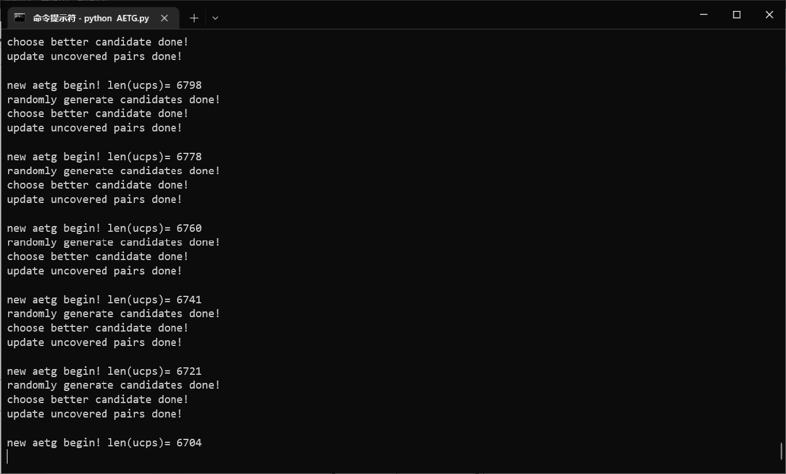
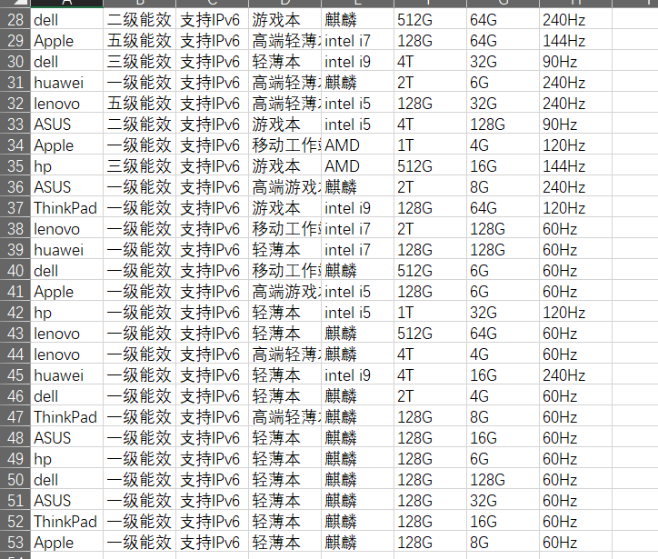
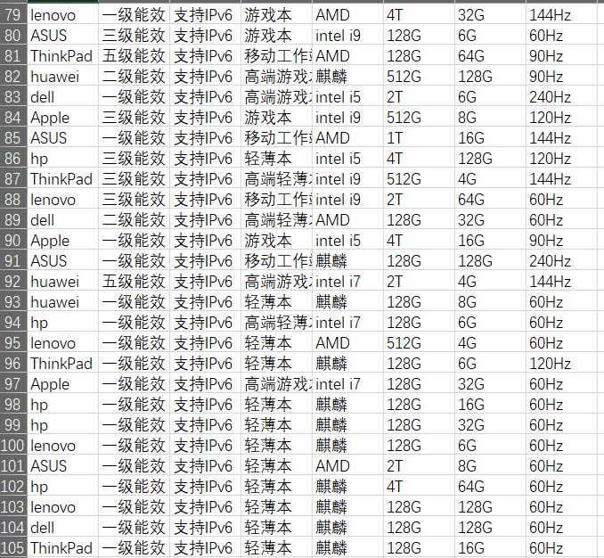

# REPORT

> pdf导出后可能会出现意料之外的换行，建议直接查看.md文件。

## AETG算法简介

经统计，大约70%以上的软件问题是由一个或２个参数作用引起的。因此参数因子两两组合就成为了软件测试中一种实施性较强同时又比较有效的方法。采用全排列组合方式的代价又十分之大，所以我们希望找到一种算法，仅使用少量的测试组合，即可完成所有参数可能性的测试。而AETG算法即为其中的一种方式，其核心逻辑如下：

>  首先按贪心算法生成一定数量Ｎ个测试用例，然后从这Ｎ个测试用例中选择一个能最多覆盖未覆盖配对集合中参数对的用例，将这个用例添加进已经形成的测试用例集Ｔ中，直至达到覆盖目标。

本项目实现了AETG算法，并以京东和携程两个网站的模型（略有删改）为例进行了测试。

## 项目文件结构

- code
  - AETG.py 
    - 实现AETG算法的主逻辑
  - utils.py 
    - 实现过程中用到的一些工具函数
  - Data.py 
    - 储存了进行AETG测试的数据

## 重要函数和结构解析

### `AETG`类

#### wise_num

`wise_num`即我们所说的`2-wise`或者`3-wise`。本项目支持任意合法的`wise_num`。

#### 类的构造

该类将会读取指定的`Data`类实例，并根据输入的`wise_num`对整个类进行初始化

```python
def __init__(self, data: Data, wise_num: int) -> None:
    self.data: Data = data
    self.data_len_list: list[int] = self.data.get_data_len_list()
    self.catagory_num = self.data.catagory_num
    self.catagory_names: list[str] = self.data.catagory
    self.wise_num = wise_num
    self.uncovered_pairs: set[
        tuple] = util.get_sorted_uncovered_pairs_from_data_len_list(
        self.data_len_list, self.wise_num)
    self.total_pairs_count = util.calculate_total_pairs_count(
        self.data_len_list, self.wise_num)
    self.test_times_min = 5  # The number of test times for find a better candicate
    self.test_times_max = 100
    self.result: list[tuple] = []
    self.readable_data: list[list[str]] = []
```

#### AETG算法函数

主函数将根据`AETG`算法进行运算，最后得出所有的参数组合，以`list[tuple]`的格式返回结果。

```py
def __aetg(self) -> list[tuple]:
    while len(self.uncovered_pairs) > 0:
        candidates: list[tuple] = self.__randomly_generate_candidates()
        better_candidate: tuple = self.__choose_better_candidate(
            candidates)
        self.__update_uncovered_pairs(better_candidate)
        self.result.append(better_candidate)
    return self.result
```

#### 动态调节的贪心方法

在AETG算法中，我们使用贪心算法多次生成测试用例，并最后从这些测试用例中选择覆盖最多的那一个。经过对于测试的中间数据的观察后可以发现：在算法的开始，即uncovered_pairs还剩下比较多的时候，该贪心选择的效果并不好，而随着uncovered_pairs的减少，贪心选择的质量将变得越发重要。

考虑到该算法的运行有着较高的时间复杂度，我们可以通过**抛弃算法前期的部分贪心效果来达成更快的运行速度**，即动态地调整我们生成测试用例的数量。

我们在类的初始化中设置我们生成测试用例数量的上下界。（上下界可以自行调整）

```python
self.test_times_min = 20  # The number of test times for find a better candicate
self.test_times_max = 100
```

然后我们在每次进行生成测试用例的时候，我们可以根据现在剩下的uncovered_pairs的数量和原始数量的比值来决定具体的测试用例数量。目前的方法是采取线性，即测试用例生成的数量随着uncovered_pairs数量的减少而线性增加。

```python
'''
Change the test_time dynamically
'''
def __get_test_time(self) -> int:
    uncovered_pairs_len = len(self.uncovered_pairs)
    percent = uncovered_pairs_len / self.total_pairs_count
    diff = self.test_times_max - self.test_times_min
    return int(self.test_times_max - diff * percent)
```

该方法可以有效减少在uncovered_pairs数量较大时的运行时间，最优的动态调整方法还有待研究。

#### `AETG`类唯一public方法：导出csv

该方法为该类中唯一的public方法，该方法将会调用AETG算法生成参数组合，并将参数组合（纯数字）根据类中`self.data.detail`储存的数据转换成具体的文字信息，并储存在csv文件中。

```python
def get_csv_result(self,csv_save_path: str) -> None:
    self.__aetg()
    self.__aetg_result_to_readable_data()
    self.__print_data_to_csv(csv_save_path)
```


### `Data`类

`Data`类为网站模型的储存结构。其通常作为父类使用，子类将会继承其中的属性和`get_data_len_list`函数。

- `catagory`属性记录了网站模型的各个数据的类型
- `catagory_num`为网站模型中数据类型的总数
- `detail`以字典格式储存了整个网站模型的数据

```python
class Data:
    def __init__(self) -> None:
        self.catagory = list()
        self.catagory_num = 0
        self.detail = dict()
        pass

    '''
    data_len_list: A list save each catagory's length of data
    Such as data_len_list=[1,2,3] means catagory[0] has 1 element, catagory[1] has 2 elements,
    catagory[3] has 3 elements.
    '''

    def get_data_len_list(self):
        data_len_list = []
        for key in self.catagory:
            data_len_list.append(len(self.detail[key]))
        return data_len_list


```

以京东的网站模型为例，我们可以构造`Data`的子类`JD_Data`。

```python
class JD_Data(Data):
    def __init__(self) -> None:
        super().__init__()
        self.catagory = ["品牌", "能效等级", "支持IPv6", "类型",
                         "处理器", "固态硬盘", "内存容量", "屏幕刷新率"]
        self.catagory_num = len(self.catagory)
        self.detail = {
            "品牌": ["hp", "lenovo", "huawei", "dell", "ASUS", "ThinkPad", "Apple"],
            "能效等级": ["一级能效", "二级能效", "三级能效", "五级能效"],
            "支持IPv6": ["支持IPv6", "不支持IPv6"],
            "类型": ["轻薄本", "游戏本", "高端轻薄本", "高端游戏本", "移动工作站"],
            "处理器": ["麒麟", "AMD", "intel i5", "intel i7", "intel i9"],
            "固态硬盘": ["128G", "512G", "1T", "2T", "4T"],
            "内存容量": ["4G", "6G", "8G", "16G", "32G", "64G", "128G"],
            "屏幕刷新率": ["60Hz", "90Hz", "120Hz", "144Hz", "240Hz"],
        }
```

#### Data 中的 data_len_list

data_len_list是贯穿项目的一个重要数据结构。其本质为`list[int]`，按照`catagory`的顺序储存了每个`catagory`在`detail`中的数据数量。

```python
	'''
    data_len_list: A list save each catagory's length of data
    Such as data_len_list=[1,2,3] means catagory[0] has 1 element, catagory[1] has 2 elements,
    catagory[3] has 3 elements.
    '''

    def get_data_len_list(self):
        data_len_list = []
        for key in self.catagory:
            data_len_list.append(len(self.detail[key]))
        return data_len_list
```


### `util`类

#### 获取uncovered_pairs

我们将以`list[tuple]`的形式储存`uncovered_pairs`。其中一个`tuple`的格式组成如下：

> 按照catagory的顺序储存每个catagory具体在detail里面选择的数值的index。若该catagory并没有选择，即填-1。
>
> 以3-pairwise、catagory_num=5为例，一个有效的tuple为：(-1,0,1,-1,3)。其表示选择了Data.catagory里的[1],[2],[4]。且实际数据分别为detail里对应catagory的第0,1,3个数据。

实际获得uncovered_pairs的方法如下：

- 根据`data_len_list`和具体的`wise_num`获取catagory的组合

```python
combinations = list(itertools.combinations(
        range(len(data_len_list)), wise_num))
```

- 根据组合，以递归的方式获取某种`catagory`组合下的所有pair

```python
@staticmethod
def get_sorted_uncovered_pairs_from_data_len_list(data_len_list: list, wise_num: int) -> set[tuple]:
    combinations = list(itertools.combinations(
        range(len(data_len_list)), wise_num))
    result = set()
    for combination in combinations:
        result = result.union(
            util.__get_pairs_in_data_len_list_from_combination(data_len_list, combination))
        return sorted(result)
'''
Recursive function.
Update the choosed_element_list based on the first element in `subcombination`.
'''
@staticmethod
def __RECUR_get_pairs_in_data_len_list_from_subcombination(
    data_len_list: list,
    choosed_element_list: list,
    subcombination: tuple
) -> set[tuple]:
    result = set()
    choosed_element_index = subcombination[0] - 1
    choosed_element_num = data_len_list[choosed_element_index]

    for i in range(choosed_element_num):
        choosed_element_list_impl = choosed_element_list.copy()
        choosed_element_list_impl[choosed_element_index] = i

        if (len(subcombination) == 1):
            choosed_element_tuple = tuple(choosed_element_list_impl)
            result.add(choosed_element_tuple)
        else:
            result = result.union(
                util.__RECUR_get_pairs_in_data_len_list_from_subcombination(
                    data_len_list,
                    choosed_element_list_impl,
                    subcombination[1:]))

            return sorted(result)
```

#### 计算参数组合覆盖的uncovered_pair数量

根据参数组合中有效`catagory`的数量将会分为两种情况，分别为

##### 有效catagory数量大于wise_num

我们的核心思路如下：

1. 使用`itertool.combination`提取出所有有效catagory的组合。
2. 根据选出的组合形成**有效catagory数量等于wise_num**的参数组合（等同于一个pair)
3. 查看该参数组合（pair）是否在uncovered_pairs里面，如果在则计数器加一
4. 返回计数器结果

具体实现可以参照`util.get_covered_count_of_incomplete_candidate`

##### 有效catagory数量小于等于wise_num

我们的核心思路如下：

1. 使用`numpy`将uncovered_pairs构造成二维矩阵

```pyth
matrix = np.array(uncovered_pairs)
```

2. 以传入的参数组合为准，将矩阵中的每一行与参数组合进行比对。我们将得到一个`matching_list`，内含所有参数组合中的非零数值在其所在列中找到的与其值相同的行的编号。

```py
candidate_length = len(incomplete_candidate)
matching_list = []
for i in range(candidate_length):
    if incomplete_candidate[i] != -1:
        colomn_i = matrix[:,i]
        # matching_list is the list of matched row index list 
        # of each element in incomplete_candidate(except -1)
        matching_list.append(np.where(colomn_i == incomplete_candidate[i]))
```

例如参数组合是[-1,-1,1,-1,2]，矩阵为

> [ [1,-1,1,-1,2],
>
> [-1,2,1,-1,-3]
>
> [-1,1,1,-1,1]

得到的`matching_list`为`[[0,1,2],[0]]`

3. 我们将matching_list中的一个element称作一个matching。若某个行数（mathing中存的数值）同时出现在所有的mathing中，则说明我们找到了一个pair成功的包含了该参数组合，计数器加一。
4. 返回计数器结果。

该方法使用了二维矩阵，使得我们只需要遍历一次整个uncovered_pair，可以较好地降低这个部分的时间复杂度。

具体实现可以参照`util.get_contained_count_of_incomplete_candidate`

## 测试结果展示

### 运行截图

以下是我们的程序运行截图



### 结果

我们以[京东页面](https://list.jd.com/list.html?cat=670%2C671%2C672&go=0)为例，我们给出我们的网页建模。

```python
class JD_Data(Data):
    def __init__(self) -> None:
        super().__init__()
        self.catagory = ["品牌", "能效等级", "支持IPv6", "类型",
                         "处理器", "固态硬盘", "内存容量", "屏幕刷新率"]
        self.catagory_num = len(self.catagory)
        self.detail = {
            "品牌": ["hp", "lenovo", "huawei", "dell", "ASUS", "ThinkPad", "Apple"],
            "能效等级": ["一级能效", "二级能效", "三级能效", "五级能效"],
            "支持IPv6": ["支持IPv6", "不支持IPv6"],
            "类型": ["轻薄本", "游戏本", "高端轻薄本", "高端游戏本", "移动工作站"],
            "处理器": ["麒麟", "AMD", "intel i5", "intel i7", "intel i9"],
            "固态硬盘": ["128G", "512G", "1T", "2T", "4T"],
            "内存容量": ["4G", "6G", "8G", "16G", "32G", "64G", "128G"],
            "屏幕刷新率": ["60Hz", "90Hz", "120Hz", "144Hz", "240Hz"],
        }
```

以下是我们的csv文件。

#### 2-pairwise



#### 3-pairwise



更多详细内容请参照`code`文件夹内的`.csv`文件。